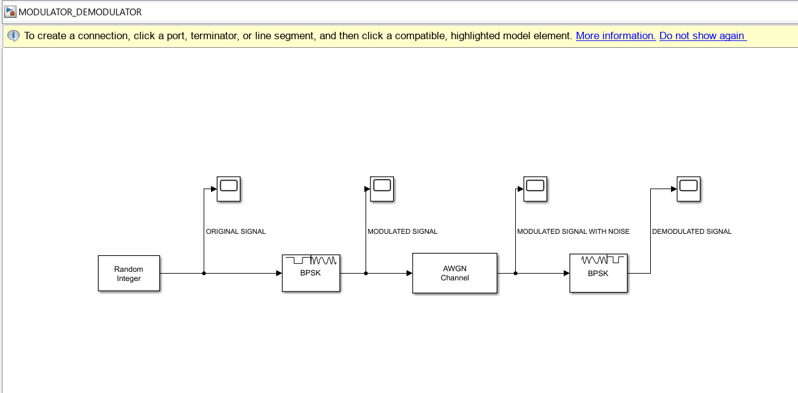

## Simulink Block Diagram

1. Random Integer block generates binary data (0 and 1).
2. BPSK Modulator converts binary bits into phase-shifted carrier signals.
3. AWGN Channel adds noise to simulate a real communication channel.
4. BPSK Demodulator recovers the transmitted signal.
5. Output scopes display original, modulated, noisy, and demodulated signals.
